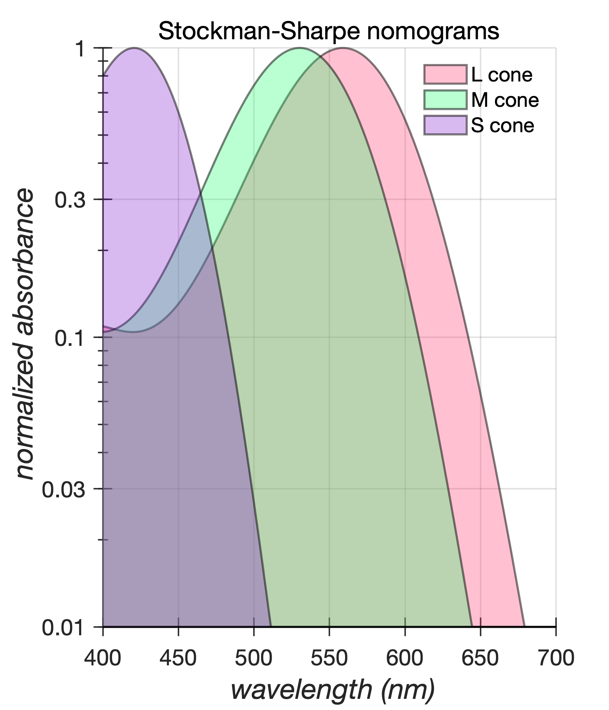

# plotlab
## Automatic generation of visually-engaging Matlab plots 

```plotlab``` is a toolbox for the automatic generation of publication quality Matlab plots. The approach followed is to override various default plotting properties of the Matlab graphics root object so as to generate visually-engaging, publication-ready plots that have a consistent appearance across computing platforms (mac and linux) and across graphics formats, all while minimizing the boilerplate code that the user has to write. 

The left column in the table below depicts a simple MATLAB snippet used to generate a line/marker combo plot. The right column depicts the plot generated by MATLAB using this code. There are two main issues with such plots: illegibility (due to the small font size, the small symbol size, the thin lines) and lack of visual appeal. 

<table bgcolor=>
<tr>
<th> Matlab code </th>
<th> Rendered output </th>
<tr>
<td>
<pre lang="matlab">
% --- Generic plotting code begins ---
%
% New figure
hFig = figure(1); clf; hold on;
%
% Scatter plots (data)
scatter(sf,c, 'ro');
scatter(sf,s, 'bo');
scatter(sf,r, 'ko');
%
% Line plots (model)
plot(sfModel, cModel, 'r-'); 
plot(sfModel, sModel, 'b-'); 
plot(sfModel, rModel, 'k-'); 
plot(sfModel, b, 'k--');
%
% Legend
legend({'center', 'surround', 'RGC'}, ...
 'Location', 'NorthEast');
%
% Title
title('mRGC');
%
% Labels
xlabel('\it spatial frequency (c/deg)'); 
ylabel('\it sensitivity');
%
set(gca, 'XLim', [0.1 100], ,...
 'XTick', [0.1 0.3 1 3 10 30 100], ...
 'YLim', [0 1.5], 'YTick', 0:0.25:1.5, ...
 'XScale', 'log');
%
% --- Generic plotting code ends ---
%
</pre>
</td>
<td>
  
</td>
</table>

`plotlab` contains functionality that can be called before the matlab script so as to alter various plotting default parameters to the user's liking. This alteration is done by calling the `plotlab.applyRecipe()` method as shown in the left column of the table below. The resulting plot is depicted in the right column. 

<table>
<tr>
<th> Matlab code </th>
<th> Rendered output </th>
<tr>
<td>
<pre lang="matlab">
% Apply a desired plotlab recipe
plotlab.applyRecipe('LineMarkerPlot', ...
  'figureWidthInches', 6, ...
  'figureHeightInches', 5);
%    
% --- Generic plotting code begins ---
%               ...
% --- Generic plotting code ends ---
%
</pre>
</td>
<td>
  
</td>
</table>

## plotlab gallery

The table below depicts a collection of plots generated by various recipes of `plotlab`. The generating matlab scripts are shown on top of each plot.
<table bgcolor=>
<tr>
 <td> `tutorials/demoLineMarkerPlot.m`</td>
 <td> `tutorials/demoAreaPlot.m`</td>
<tr>
 <td>  </td>
 <td>  </td>
</table>
