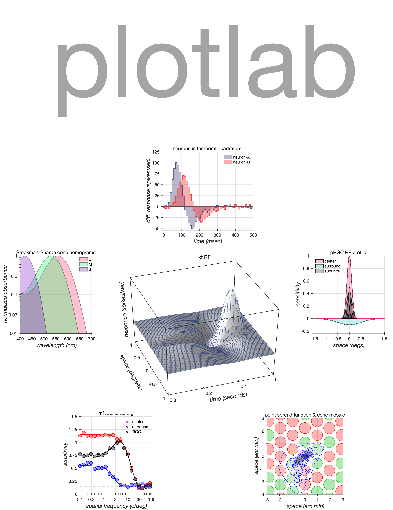
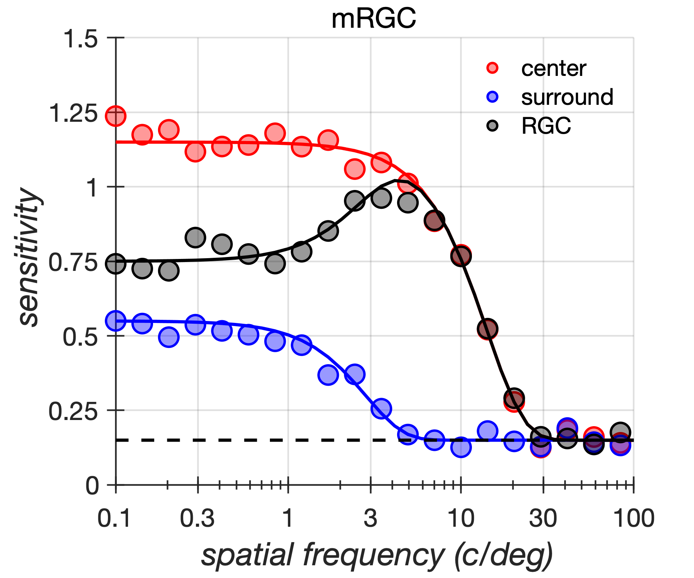
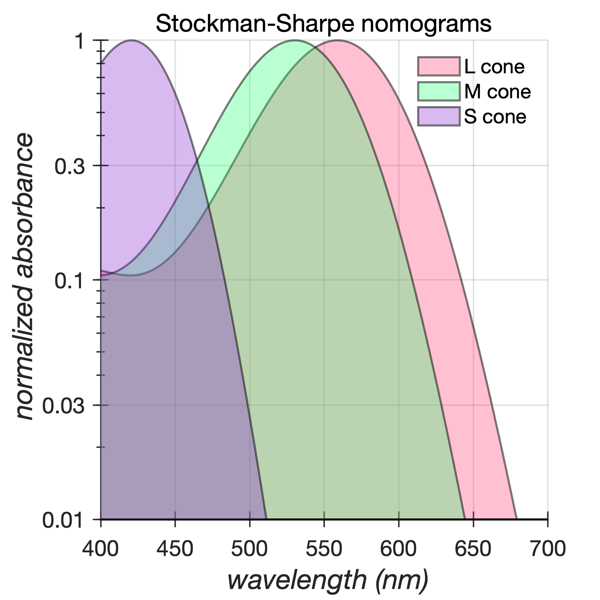

# plotlab

## Automatic generation of visually-engaging Matlab plots 

```plotlab``` is a toolbox for the automatic generation of publication quality Matlab plots. The approach followed is to define 'recipes' which override various default plotting properties of the Matlab graphics root object, so as to generate plots that are visually-engaging and publication-ready, with a consistent appearance across operating systems (mac/linux) and graphics formats (vector/raster).

This paradigm minimizes the amount of boilerplate code for setting various plotting options and offer  different ways to generate beautiful plots with just a few generic plotting commands, even from the command window. `plotlab` includes several tutorials that demonstrate the different ways with  which one can override the default parameters for different plot types.

## The problem addressed
The left column in the table below depicts a simple MATLAB snippet used to generate a line/marker combo plot. The right column depicts the plot generated using this code. There are two main issues with this, and, in general, with all the default MATLAB plots: 
- illegibility, due to the small font size, the small symbol size, line thickness, etc, and,
- an overall lack of visual appeal

<table bgcolor=>
<tr>
<th> Matlab code </th>
<th> Rendered output </th>
<tr>
<td>
<pre lang="matlab">
% --- Generic plotting code begins ---
%
% New figure
hFig = figure(1); clf; hold on;
%
% Scatter plots (data)
scatter(sf,c, 'ro');
scatter(sf,s, 'bo');
scatter(sf,r, 'ko');
%
% Line plots (model)
plot(sfModel, cModel, 'r-'); 
plot(sfModel, sModel, 'b-'); 
plot(sfModel, rModel, 'k-'); 
plot(sfModel, b, 'k--');
%
% Legend
legend({'center', 'surround', 'RGC'}, ...
 'Location', 'NorthEast');
%
% Title
title('mRGC');
%
% Labels
xlabel('\it spatial frequency (c/deg)'); 
ylabel('\it sensitivity');
%
set(gca, 'XLim', [0.1 100], ,...
 'XTick', [0.1 0.3 1 3 10 30 100], ...
 'YLim', [0 1.5], 'YTick', 0:0.25:1.5, ...
 'XScale', 'log');
%
% --- Generic plotting code ends ---
%
</pre>
</td>
<td>
  
</td>
</table>

## The plotlab solution
`plotlab` contains functionality that is engaged before issuing any Matlab plotting commands and which overrides plotting parameters from their factory settings to the settings preferred by the user so as to achieve a preferred look. This is done by calling the `applyRecipe()` method of the `@plotlab` object. The  override of the plotting parameters remains in effect for the current Matlab session, or until a new call to the `applyRecipe()` method  is issued, and is reversed once the user exits the current Matlab session.

`plotlab` offers 3 different ways for overriding the default plotting parameters:
1. by passing key-value pair arguments to the `applyRecipe()` method. This is a good choice if the user likes most of the choices in the default recipe of `plotlab` and only wishes to modify a few individual parameters.
2. by passing a function handle to a private recipe that is included in the user's script.
3. by passing a function handle to one of the recipe functions included in the `recipes` directory. Files in the `recipes`  directory can include several recipe functions and the user can select which one to apply.

In the table below, override method no. 1 is used, thereby accepting the default `plotlab` recipe and only overriding the figure size. The resulting plot is depicted in the right column. Comparison to Matlab's default plot (depicted in the table above) shows the drastic enhancement in visual appeal and legibility offered by the default recipe of `plotlab`.

<table>
<tr>
<th> Matlab code </th>
<th> Rendered output </th>
<tr>
<td>
<pre lang="matlab">
% Apply a desired plotlab recipe
plotlab.applyRecipe(...
  'figureWidthInches', 6, ...
  'figureHeightInches', 5);
%    
% --- Generic plotting code begins ---
%               ...
% --- Generic plotting code ends ---
%
</pre>
</td>
<td>
  
</td>
</table>

Completely customized plots can be obtained by using overriding methods no. 2 and no. 3, which pass recipe function handles to the `applyRecipe()` method. Recipe functions are called after the default `plotlab` recipe is applied and can modify additional plotting parameters (or override parameters set by the default recipe) so as to achieve a more specialized look. In override method no. 2, the user passes a private recipe which is included as an internal function in the same script as the plotting code. This can be a good option if the user does not want to include the recipe in the `recipes` directory, or if the particular recipe is only used once. In override method no. 3, the user selects one of the available pre-configured recipes in the `recipes` directory. Users can add their own recipes in the `recipes`  directory for repeated use in different scripts and/or for sharing with other users.

The code below shows an example of how to use an external recipe, here the second recipe contained in the `\recipes\PSTHrecipe.m` file.

```
% Get handles to all the recipe functions included in file 'PSTHrecipe.m'
externalRecipes = PSTHrecipes;
    
% Let's go with the second recipe
whichExternalRecipe = externalRecipes{2};
    
% How to color the neuron responses. This
% matrix is passed as an input argument to
% the chosen recipe function handle.
neuronColors = [...
   0.3 0.3 0.5; ...  % neuron 1 in gray
   1 0.2 0.2 ...     % neuron 2 in pinkish-red
   ];
   
% Apply the chosen recipe passing the neuronColors as input argument
plotlab.applyRecipe(...
   'customRecipeFunction', @()whichExternalRecipe(neuronColors), ...
   'figureWidthInches', 6, ...
   'figureHeightInches', 5);
 ```

## Tutorials
The `tutorials` directory contains tutorials that show different ways of using `plotlab` to enhance a variety of plot types. 

## Writing recipe funcions
As of MATLAB version 2019B, the graphics root object contains around 2,000 properties that control the appearance of different plots. Going through all of them to find the one that controls a particular aspect of a plot can be daunting. The `plotlab.displayPropertiesReferringTo()` method can be used to find these properties fast. For example, to find out which properties contol the line width, type the following in the command window.
```
plotlab.displayPropertiesReferringTo('LineWidth');
```
The method returns all properties that contain the `LineWidth` string in their names, along with their factory values.
The method also returns any properties containing that string and which the user has overriden their default value in the current session. Below is the output of the above command in a fresh Matlab session.
```
>> plotlab.displayPropertiesReferringTo('LineWidth');

Searching for graphics properties referring to 'LineWidth'...
Found 38 *factory* properties with a reference to 'LineWidth'.
    1. AnimatedlineLineWidth                                 with values: 0.5 
    2. AreaLineWidth                                         with values: 0.5 
    3. ArrowshapeLineWidth                                   with values: 0.5 
    4. AxesLineWidth                                         with values: 0.5 
    5. BarLineWidth                                          with values: 0.5 
    6. CategoricalhistogramLineWidth                         with values: 0.5 
    7. ColorbarLineWidth                                     with values: 0.5 
    8. ContourLineWidth                                      with values: 0.5 
    9. DoubleendarrowshapeLineWidth                          with values: 0.5 
   10. EllipseshapeLineWidth                                 with values: 0.5 
   11. ErrorbarLineWidth                                     with values: 0.5 
   12. FunctioncontourLineWidth                              with values: 0.5 
   13. FunctionlineLineWidth                                 with values: 0.5 
   14. FunctionsurfaceLineWidth                              with values: 0.5 
   15. GeoaxesLineWidth                                      with values: 0.5 
   16. GraphplotLineWidth                                    with values: 0.5 
   17. Histogram2LineWidth                                   with values: 0.5 
   18. HistogramLineWidth                                    with values: 0.5 
   19. ImplicitfunctionlineLineWidth                         with values: 0.5 
   20. ImplicitfunctionsurfaceLineWidth                      with values: 0.5 
   21. LegendLineWidth                                       with values: 0.5 
   22. LineLineWidth                                         with values: 0.5 
   23. LineshapeLineWidth                                    with values: 0.5 
   24. ParameterizedfunctionlineLineWidth                    with values: 1 
   25. ParameterizedfunctionsurfaceLineWidth                 with values: 0.5 
   26. PatchLineWidth                                        with values: 0.5 
   27. PolaraxesLineWidth                                    with values: 0.5 
   28. QuiverLineWidth                                       with values: 0.5 
   29. RectangleLineWidth                                    with values: 0.5 
   30. RectangleshapeLineWidth                               with values: 0.5 
   31. ScatterLineWidth                                      with values: 0.5 
   32. StairLineWidth                                        with values: 0.5 
   33. StemLineWidth                                         with values: 0.5 
   34. SurfaceLineWidth                                      with values: 0.5 
   35. TextLineWidth                                         with values: 0.5 
   36. TextarrowshapeLineWidth                               with values: 0.5 
   37. TextarrowshapeTextLineWidth                           with values: 0.5 
   38. TextboxshapeLineWidth                                 with values: 0.5 

Found 0 *default* properties with a reference to 'LineWidth'.
```

## Additional capabilities
`plotlab` also contains scripts for altering the look of plots beyond what can be achieved by setting the graphics root object properties, or for generating more complex plots. For example `plotlab.offsetAxes(gca)` offsets the x and y axes by a specified percent of their respective range (3% by default) to help visualizing data points that lie close to the axes, and `plotlab.transparentContourPlot()` can be used to generate contour plots that are semitransparent.

## Installation
To download using ToolboxToolbox: run `tbUse('plotlab')` from the command window.
To install: run `plotlabLocalHookTemplate()` from the command window.

# plotlab gallery

A representative collection of plots generated by various tutorials of `plotlab` are included in the table below.
<table bgcolor=>
<tr>
 <td> <pre> t_lineMarkerPlot.m </pre> </td>
 <td> <pre> t_areaPlot.m </pre> </td>
<tr>
 <td>  </td>
 <td>  </td>
 <tr>
 <td> <pre> t_areaPloUsingInternalRecipe.m </pre> </td>
 <td> <pre> t_histogramPlotUsingExternalRecipe.m </pre> </td>
  <tr>
 <td>  </td>
 <td>  </td>
 <tr>
 <td> <pre> t_contourPlot.m </pre> </td>
 <td> <pre> t_??.m </pre> </td>
 <tr>
 <td>  </td>
 <td>  </td>
</table>
