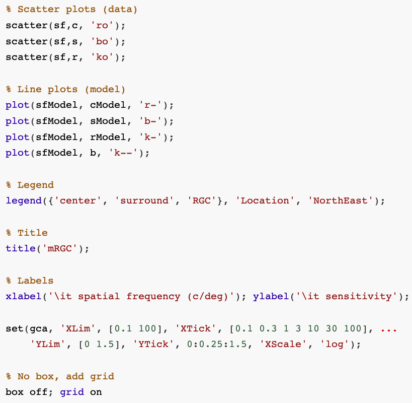

# plotlab
A toolbox for the automatic generation of publication quality Matlab plots

Scientific plots generated via the default plot settings in Matlab are un-appealing and quite illegible.
The plotlab toolbox changes the default plot settings so as to render plots that are visually-engaging, publication-ready, and consistent across computing platforms (mac and linux) and across graphics formats. 

   
| default plot  | plotlab plot|
| ------------- | ------------- |
|   | |
| --------- |   |

