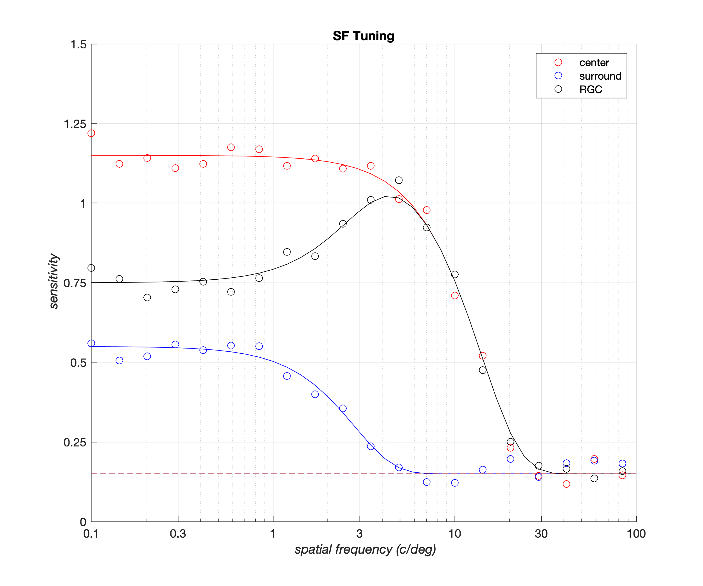

# plotlab: automating generation of visually-engaging Matlab plots 
Plotlab is a toolbox for the automatic generation of publication quality Matlab plots. The approach followed is to override various default plotting properties of the Matlab graphics root object so as to generate visually-engaging, publication-ready plots that have a consistent appearance across computing platforms (mac and linux) and across graphics formats, all while minimizing the boilerplate code that the user has to write. 

<table bgcolor=>
<tr>
<th> Matlab code </th>
<th> Rendered output </th>
<tr>
<td>
<pre lang="matlab">
% --- Generic plotting code begins ---
%
% New figure
hFig = figure(1); clf; hold on;
%
% Scatter plots (data)
scatter(sf,c, 'ro');
scatter(sf,s, 'bo');
scatter(sf,r, 'ko');
%
% Line plots (model)
plot(sfModel, cModel, 'r-'); 
plot(sfModel, sModel, 'b-'); 
plot(sfModel, rModel, 'k-'); 
plot(sfModel, b, 'k--');
%
% Legend
legend({'center', 'surround', 'RGC'}, ...
 'Location', 'NorthEast');
%
% Title
title('mRGC');
%
% Labels
xlabel('\it spatial frequency (c/deg)'); 
ylabel('\it sensitivity');
%
set(gca, 'XLim', [0.1 100], ,...
 'XTick', [0.1 0.3 1 3 10 30 100], ...
 'YLim', [0 1.5], 'YTick', 0:0.25:1.5, ...
 'XScale', 'log');
%
% --- Generic plotting code ends ---
%
</pre>
</td>
<td>
  
</td>
</table>
   
<table>
<tr>
<th> Matlab code </th>
<th> Rendered output </th>
<tr>
<td>
<pre lang="matlab">
% Apply a desired plotlab recipe
plotlab.applyRecipe('LineMarkerPlot', ...
  'figureWidthInches', 6, ...
  'figureHeightInches', 5);
%    
% --- Generic plotting code begins ---
%               ...
% --- Generic plotting code ends ---
%
</pre>
</td>
<td>
  
</td>
</table>
